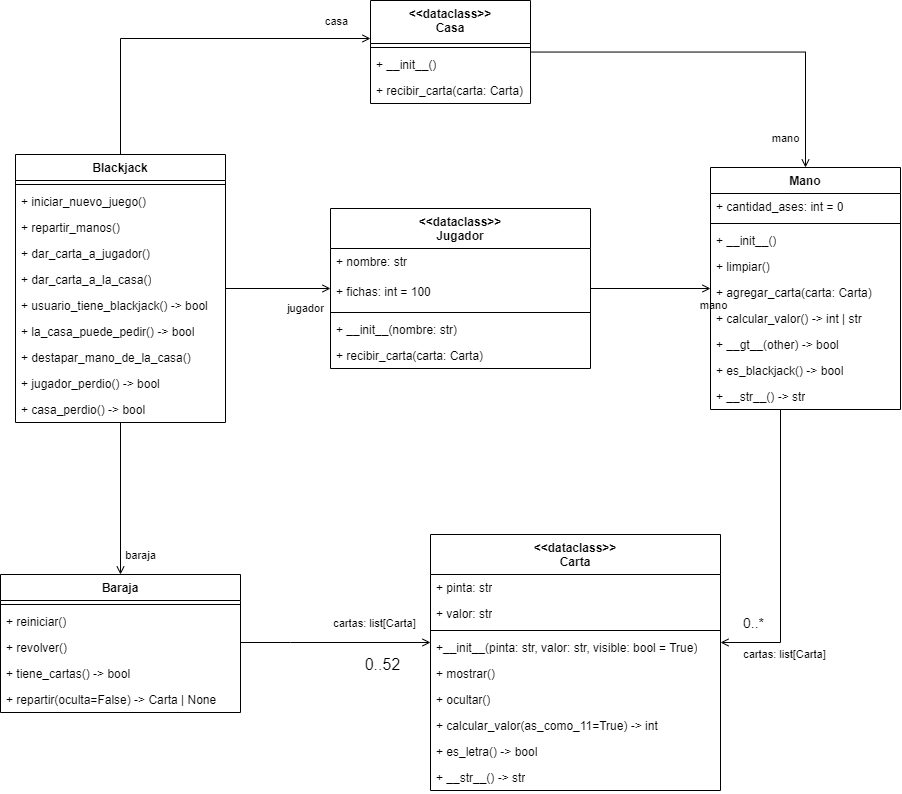

# Ejercicio BlackJackApp

Para este ejercicio debes implementar una aplicación para simular un juego de BlackJack en Python entre un jugador y la
casa (representada por el sistema). El objetivo del juego es que la mano del jugador llegue lo más cerca posible a 21 
sin pasarse. Si la mano del jugador se pasa de 21, pierde el juego. Si no se pasa de 21, entonces se compara con la 
mano de la casa para ver quien estuvo más cerca. Si la mano de la casa se pasa de 21, el jugador gana.

En el juego de blackjack hay una baraja que contiene 52 cartas. Cada carta tiene una pinta y un valor.
Las pintas pueden ser CORAZÓN, TRÉBOL, DIAMANTE y ESPADA; los valores pueden ser A, 2, 3, 4, 5,
6, 7, 8, 9, 10, J, Q, K.

Cada carta vale lo mismo que el número que representa, excepto las cartas cuyo valor es una letra.
Para estas cartas, el valor se determina así:

- Si la carta es J, Q o K, el valor es 10
- Si la carta es A, el valor puede ser 11 o 1

Una vez se reparten las manos, inicia el turno del jugador. Si el valor de las cartas iniciales de la
mano del jugador suma 21, automáticamente gana el juego, ya que logró hacer blackjack. Si no es
así, entonces, el jugador puede pedir una nueva carta para su mano o detenerse. Si pide una nueva
carta, esta se suma al valor de su mano. Si el valor es mayor de 21, pierde inmediatamente el juego,
si no lo es puede seguir pidiendo cartas hasta que decida detenerse.

Cuando el jugador se detiene comienza el turno de la casa. En dicho turno, se destapa la carta oculta
de la mano de la casa y esta puede empezar a pedir cartas. La lógica de la casa para pedir cartas es
la siguiente:

- Si el valor de la mano de la casa es menor o igual al valor de la mano del jugador y el valor de la
mano de la casa no es mayor que 16, entonces pide una carta.
- Si con la nueva carta, el valor de la mano de la casa sobrepasa 21, la casa pierde el juego

En caso de empate entre la casa y el jugador, el jugador recibe lo que apostó en la mano. Si el jugador
gana, la casa le dobla lo apostado. Y si el jugador pierda, se le resta lo apostado de sus fichas.

La idea es que la aplicación durante un juego vaya mostrando las manos tanto del jugador como de
la casa y le dé la opción al jugador de pedir una nueva carta o parar.

El jugador solo podrá jugar mientras tenga fichas disponibles para apostar.

Para implementar la aplicación debes tener en cuenta el siguiente modelo de clases:

